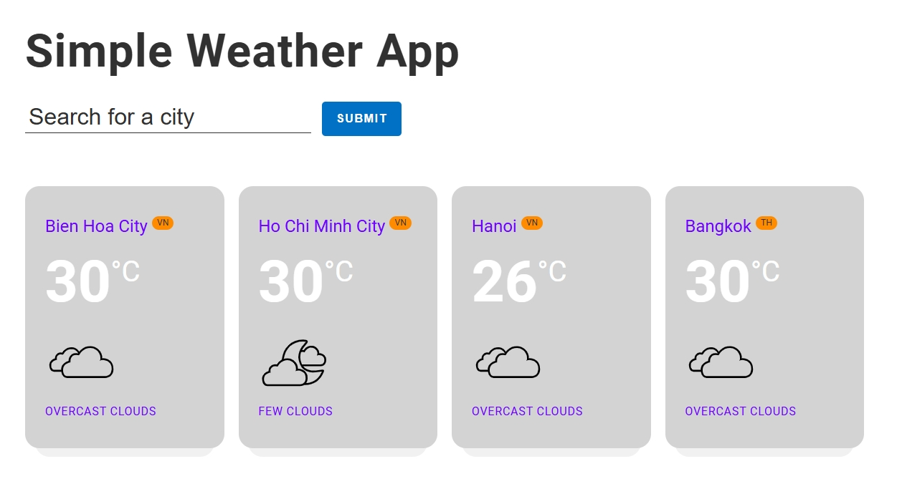

# simple-vanilla-javascript-app

Build a fully functional weather application using Vanilla JavaScript. This tutorial covers everything from setting up the app to fetching and displaying weather data from OpenWeatherMap API.

